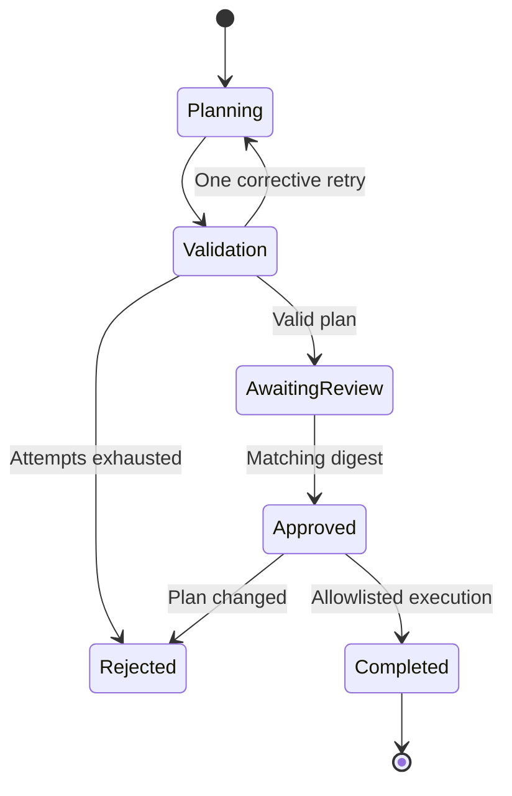

# Agentic QA Workbench

A bounded workflow that turns requirements into structured test plans, pauses for
review of the exact plan, and runs only approved operations. The example application
implements document-title validation and document access rules.

## Run it

```bash
python app.py demo
```

The self-contained demo simulates review and deliberately introduces an off-by-one
bug: an 80-character title is rejected. It reports **7 passes and 1 expected failure**.
The separate repository unit tests verify that the workflow catches this defect.

For an actual review checkpoint:

```bash
python app.py plan --state .runtime/my-plan.json
# Inspect the saved tests and copy the printed plan_digest.
python app.py approve --state .runtime/my-plan.json --approve-digest COPY_PRINTED_DIGEST_HERE
python app.py run --state .runtime/my-plan.json
```

To use local model planning, start with a new state filename:

```bash
python app.py plan --model YOUR_GENERATION_MODEL --state .runtime/model-plan.json
```

## Implemented

- A versioned requirement snapshot and structured test plan.
- Strict tool/input/output schemas and complete requirement-ID coverage.
- At most two model planning attempts, with validation feedback.
- SHA-256-bound review: changed plans or requirements invalidate the checkpoint.
- Atomic checkpoint writes and resumable plan/approve/run commands.
- An allowlisted tool registry; no model-generated shell or Python execution.
- Per-test expected/actual results and nonzero exit status for failed `run` tests.

## State transitions



## Boundaries

Offline planning copies curated fixtures. Live model planning is implemented but
untested with a real model. Schema validity and requirement-ID coverage do not
prove a good test oracle or meaningful behavioral coverage. The reviewer must
inspect expected outcomes. Checkpoint hashes detect accidental changes, not an
attacker who can rewrite the whole file. There is no identity service, signed
approval ledger, parallel writer support, or integration with a real mobile app.

## Verification and scope

```bash
python -m unittest discover -s tests -v
```

Python 3.11+ is required. Runtime and tests use only the standard library.
GitHub Actions is configured for Python 3.11, 3.12 and 3.13; only Python 3.12
was executed during preparation. See [validation](docs/validation.md) and
[recorded demo output](docs/demo-output.json).

The default demo is deterministic and uses synthetic data. The optional Ollama
adapter follows the [generation API](https://docs.ollama.com/api/generate) and
[embedding API](https://docs.ollama.com/api/embed). Adapter contract tests use mock
responses. No live model, cloud service or paid provider was tested. Replace
model placeholders with models already installed in your local Ollama server.

This is a focused reference implementation prepared with AI assistance. It does
not claim production deployment, measured business impact, or enterprise readiness.
Read the [architecture decisions](docs/architecture.md) and
[interview walkthrough](docs/interview.md) before presenting it.
